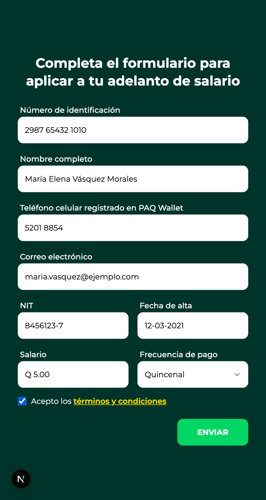
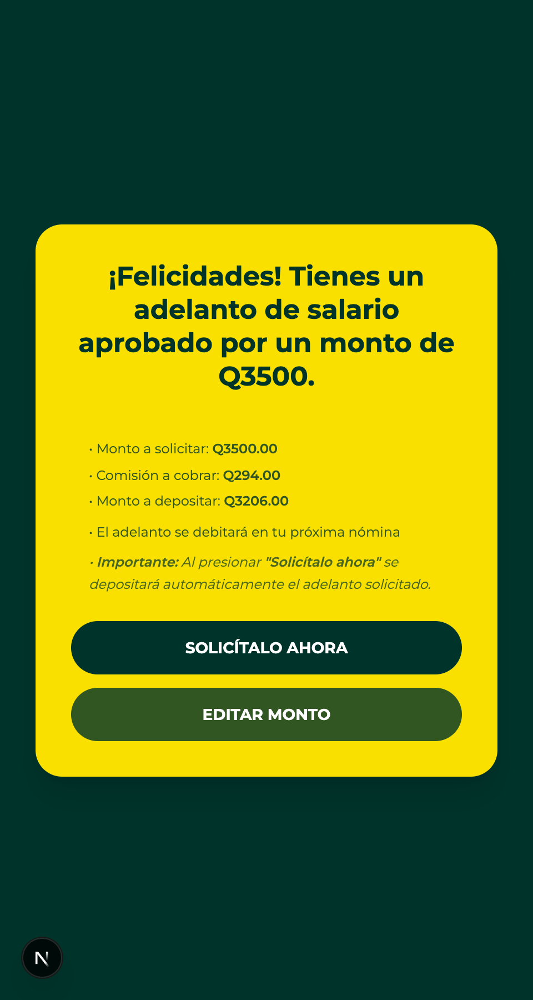
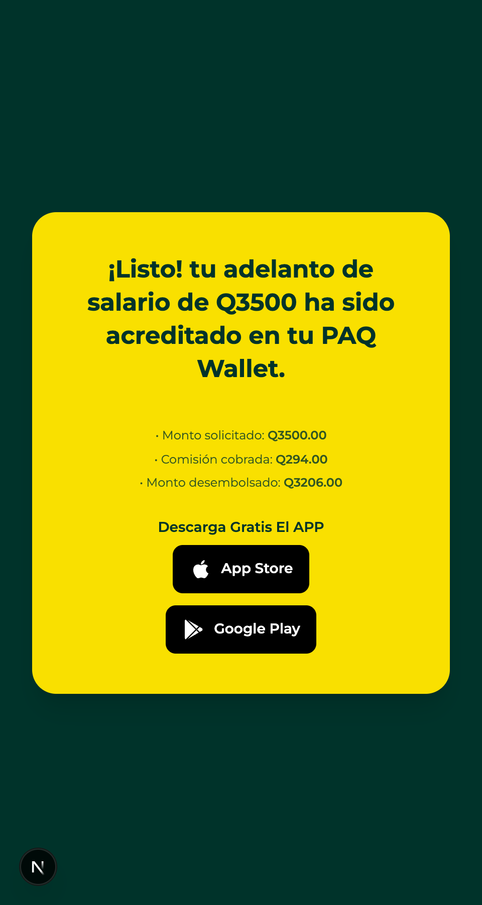
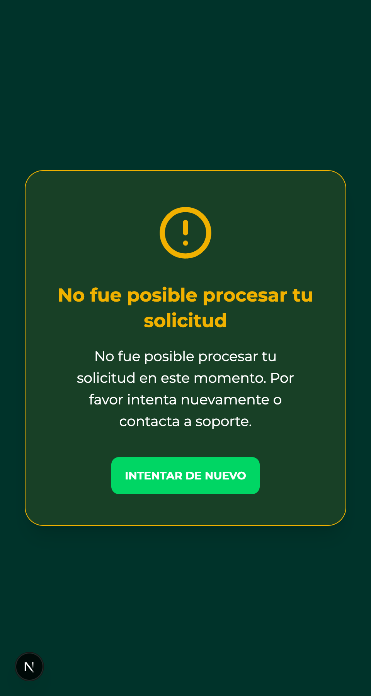

# Flujo Adelanto de Salario — capturas (dev)

Generadas con `?devStep=0..5` en modo desarrollo.

## Paso 0 — Teléfono

## Paso 1 — Formulario

## Paso 2 — Código SMS

## Paso 3 — Aprobación / monto

## Paso 4 — Éxito

## Paso 5 — Error

